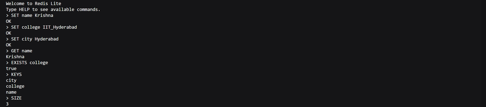
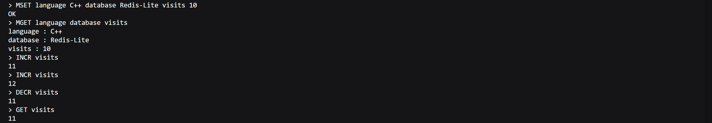
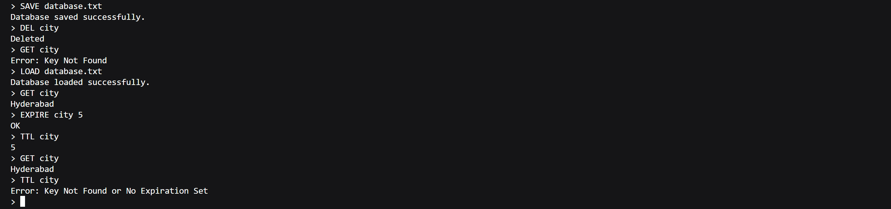

# Redis Lite

A Redis-inspired in-memory key-value store built in C++ that supports basic database operations, persistence, batch operations, key expiration, and atomic numeric operations through an interactive command-line interface.

---

## Demo

### Core Operations


### Batch & Numeric Operations


### Expiration & Persistence


---

## Features

- Store and retrieve key-value pairs (`SET`, `GET`)
- Delete and check key existence (`DEL`, `EXISTS`)
- Display all stored keys (`KEYS`)
- Display the total number of keys (`SIZE`)
- Save and load the database from disk (`SAVE`, `LOAD`)
- Atomic increment and decrement operations (`INCR`, `DECR`)
- Batch operations (`MSET`, `MGET`)
- Key expiration using `EXPIRE`
- Time-to-Live lookup using `TTL`
- Lazy expiration of expired keys
- Interactive command-line interface

---

## Data Structures Used

- `unordered_map<string, string>` for O(1) average key-value storage
- `unordered_map<string, long long>` for storing expiration timestamps
- `vector` for batch operations and safe cleanup
- `stringstream` for command parsing
- `fstream` for persistence
- `chrono` for time-based expiration

---

## Supported Commands

| Command | Description |
|---------|-------------|
| `SET key value` | Store a key-value pair |
| `GET key` | Retrieve the value of a key |
| `DEL key` | Delete a key |
| `EXISTS key` | Check whether a key exists |
| `KEYS` | Display all keys |
| `SIZE` | Display total number of keys |
| `SAVE filename` | Save the database to disk |
| `LOAD filename` | Load the database from disk |
| `INCR key` | Increment an integer value |
| `DECR key` | Decrement an integer value |
| `MSET k1 v1 k2 v2 ...` | Store multiple key-value pairs |
| `MGET k1 k2 ...` | Retrieve multiple values |
| `EXPIRE key seconds` | Set expiration time for a key |
| `TTL key` | Show remaining lifetime of a key |

---

## Time & Space Complexity

| Operation | Time Complexity | Space Complexity |
|----------|:---------------:|:----------------:|
| SET | O(1) average | O(1) |
| GET | O(1) average | O(1) |
| DEL | O(1) average | O(1) |
| EXISTS | O(1) average | O(1) |
| SIZE | O(n)* | O(n)* |
| KEYS | O(n log n) | O(n) |
| SAVE | O(n) | O(1) |
| LOAD | O(n) | O(n) |
| INCR / DECR | O(1) average | O(1) |
| MSET | O(k) | O(1) |
| MGET | O(k) | O(k) |
| EXPIRE | O(1) average | O(1) |
| TTL | O(1) average | O(1) |

**Note:**
- `n` = number of keys in the database.
- `k` = number of keys supplied to `MSET`/`MGET`.
- `SIZE` performs lazy cleanup of expired keys, making its worst-case complexity **O(n)** in this implementation.

---

## Technologies

- C++
- STL
- `unordered_map`
- `vector`
- `stringstream`
- `fstream`
- `chrono`

---

## Limitations

- Data is stored entirely in memory.
- Persistence uses a simple text-based serialization format.
- Expiration metadata is not persisted across `SAVE` and `LOAD`.
- Single-threaded implementation.
- Supports only string keys and string values.
- No networking support or client-server architecture.
- Does not implement advanced Redis data structures such as Lists, Sets, Hashes, or Sorted Sets.

---

## Future Enhancements

- Persist expiration metadata during `SAVE` and `LOAD`
- Background expiration thread instead of lazy expiration
- Modular project structure (`include/` and `src/`)
- Networking support using sockets
- Transaction support (`MULTI` / `EXEC`)
- Additional Redis data structures
- Comprehensive unit testing

---

## How to Run

### Compile

```bash
g++ main.cpp -o redis-lite
```

### Run

**Linux/macOS**

```bash
./redis-lite
```

**Windows**

```bash
redis-lite.exe
```

---

## Project Status

**Version 1.0.0 – Stable Release**

Redis Lite currently supports:

- Core key-value operations
- Batch commands
- Persistent storage
- Atomic numeric operations
- Key expiration with lazy cleanup
- Interactive command-line interface

The project is stable and serves as a simplified Redis-inspired database implemented entirely in modern C++.

---

## License

This project is licensed under the MIT License.
